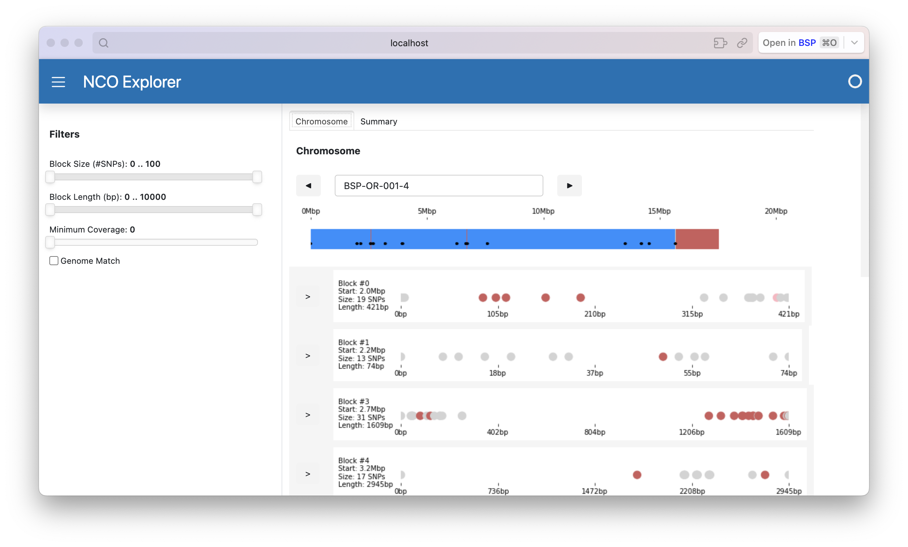
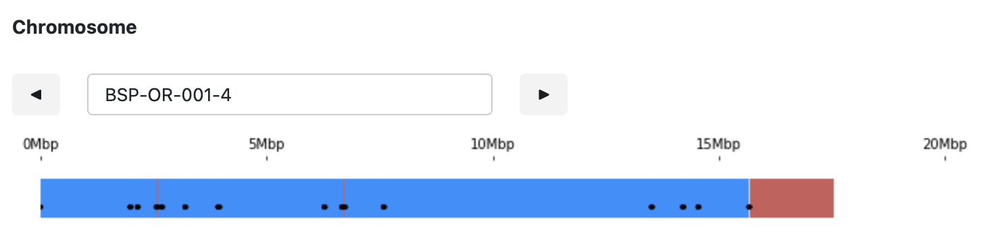
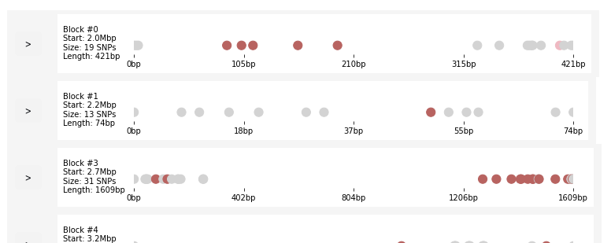
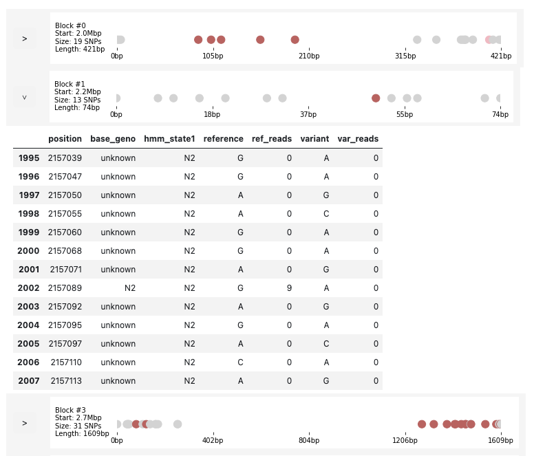
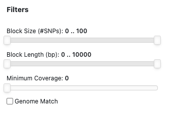
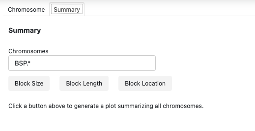
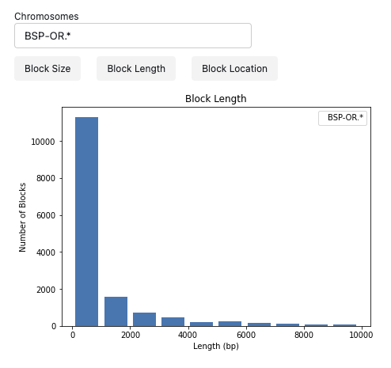

# View SNPs in the GUI

The GUI allows users to explore the blocks generated by the `peaks` command.

The window has two parts, as shown by this screenshot:



The left side of the screen displays a set of **filters** which allow you to set limits on sizes and other attributes of blocks.

The right side of the window is for graphical displays.  Note there are two tabs at the top of this part of the window.  The **chromosome tab**, shown above, displays one chromosome at a time.  Clicking the **summary tab** will change to show plots that summarize all the blocks in the data set.

## Opening the GUI

From the command line run the `xo` script with the `gui` command:

```bash
$ xo gui
```

The GUI is based on a Python library named Panel.  It's similar to Jupyter in that it creates a server on your local system, and you use the GUI by opening a web browser and connecting to the server.  The default port number is 5006, but you can specify a different port with the `--port` option if you need to (_e.g._ if you have a different web app already using that port).

The GUI needs two data files.  The first is the CSV file with block descriptions created by the `xo peaks` command.  The default file name is `peaks.csv`, but you can specify a different name using the `--peaks` option.

The other data file used by the GUI is a summary of locations of blocks of SNPs.  The default file name is `BSP_TIGER.intervals_dataframe.pickle.gzip`, but a different name can be specified using `--intervals`.

## Chromosome Display

At the top of the chromosome tab you will see a box containing a chromosome name with two buttons on either side.  Below that is a "ribbon" that classifies regions of the chromosome as having come from the CB4856 parent (in blue) or the N2 parent (in red).  The black dots represent the locations of blocks of SNPs identified by the peak finder.



The controls allow you to switch to a different chromosome.  Click the triangle shaped buttons next to the chromosome name to move to the previous or next chromosome in the data set.  If you want to go directly do a different chromosome click on the chromosome name and edit the name there.  If the name is valid the display will be updated when you hit the enter key or click somewhere outside the text box.

> Note: If a chromosome has a lot of blocks there will be a delay before the screen is updated while the app makes all the graphics for the lower part of the display.

Below the "ribbon" you will see the blocks identified by the peak finder for the current chromosome. This screenshot shows the first three blocks for chromosome BSP-OR-001-4:



The circles in each row correspond to the SNPs in that block.  The scale below the circles indicates the relative position of each SNP, and the text to the left has an overview of the block.  In this example, the first row of circles is for a block that starts 2Mbp into the chromosome.  The block has 19 SNPs, spread out over a region 421bp long (the distance between the first and last SNP in the block).

The colors of the circles are based on how the HMM in TIGER classified the SNPs.  

- Bright blue and red are where the HMM is confident a SNP is from CB4856 or N2, respectively.  
- Paler blue and red are for SNPs with lower confidence.
- Gray and yellow are for undetermined or ambiguous SNPs.

To the left of each row of circles is a button with a "reveal" icon (looks like a greater-than symbol). If you click this button the GUI will show a table based on the data frame for the block, showing all the details of each SNP.  Here is the display for block #1 in the example:



Note how there are 13 rows, one for each SNP, and that each row corresponds to a circle in the graphic.  Most of the circles are gray ("unknown") but one is bright red, having been identified as an N2 SNP.

Clicking the button again will hide the block.

## Filters

There are four ways to control which SNPs are displayed in the blocks:

- a **block size filter** limits the display to contain only blocks that have a number of SNPs between a lower and upper limit
- a **block length filter** shows only blocks that have an overall length -- the distance, in base pairs, between the first and last SNP in the block -- within a specified lower and upper limit
- the **minimum coverage** filter selects SNPs that are supported by reads (the values in the `ref_reads` and `var_reads` columns in the SNP table); a SNP is included in the display if the sum of the numbers in these two columns is greater then a specified limit
- the **genome match** filter is either on or off; when it's on, a SNP is included only if the state inferred by the HMM (shown in the `hmm_state1` column in the table) matches the base in the chromosome (indicated by the `base_geno` column).

### Widgets

Each filter has its own "widget" on the left side of the GUI that is used to set values for that filter:



#### Block Size Widget

Click on the control on the left side of the slider and drag it to set the minimum block size, or click and drag the control on the right to set the maximum block size.

As you drag a control the display will update to show the new value.  The value won't take effect until you let go of the button.

#### Block Length Widget

This widget is another double-sided slider, used the same way as the block size widget, but this one controls the block length.

#### Minimum Coverage Widget

This slider has only one button, used to specify the coverage value.  You can either drag the button or click anywhere along the length of the slider.

#### Genome Match Widget

This widget is a simple check-box.  Click inside the box to turn the filter on or off.

### How Filters are Applied

The chromosome display will be updated immediately, as soon you update a widget.

> **All four filters are applied each time the display is updated.**
>

Each time the chromosome display is updated -- either by adjusting one of the widgets, or by selecting a new chromosome -- all the filters are applied and the resulting SNPs are used to generate the display.

- Only those blocks that are within the bounds of the block size and block length filters are shown.
- Inside the blocks that pass those filters only SNPs that pass the coverage and match filters are shown.

## Summary Plots

The other tab in the graphics panel is named **Summary**.  Click on the tab name to display a set of controls for generating plots based on summarizing filtered blocks across all chromosomes:



### Chromosome Names

The default setting will generate plots using all of the chromosomes.  However, if you want to make separate plots for different groups, you can enter a name pattern using regular expression syntax in the text box labeled "Chromosomes".

The initial value in this box is `BSP.*`, meaning "any chromosome with a name that starts with BSP" (in other words, all chromosomes).  Some other examples of name patterns:

| pattern       | chromosomes used                                             |
| ------------- | ------------------------------------------------------------ |
| `BSP-OR.*`    | all oocytes                                                  |
| `BSP-SR.*`    | all spermatocytes                                            |
| `BSP-OR-10.*` | the 10 worms with names BSP-OR-001, BSP-OR-002, ... BSP-OR-009. |
| `BSP-SR-.*-1` | chromosome 1 for all spermatocytes                           |

### Buttons

The three summary plots are all histograms.  Click the button for the summary you want, based on block size, block length, or block location (relative location on the chromosome).

Note that the histograms will be based on filtered data.

- The application first selects the chromosomes that have names that match the pattern in the "Chromosomes" box.
- It then applies all the filters, using the current settings in the filter widgets.
- The result blocks are then used to generate the histograms.

When the graph has been generated (it may take a few seconds) it will be displayed in the GUI:



## Exiting the GUI

Close the web browser window.

If you started the GUI by typing `xo gui` on the command line you can stop it by clicking in the terminal window and typing `⌃C` (control-C).

